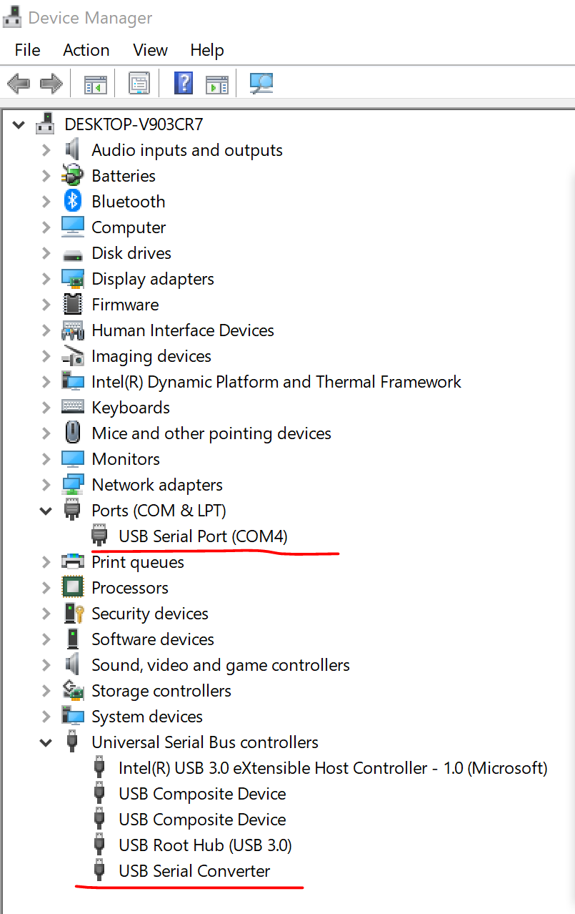

# ub\_dongle wrapper library

Node.js wrapper for UART protocol for communication with ub\_dongle.
Provides transport over UART or MQTT via Gateways.

## Usage examples

Basic examples for using the library are located in [examples](./examples) folder.

### How to test

#### windows, windows 10

1. Make sure driver installed, install the [driver](http://www.ftdichip.com/Drivers/CDM/CDM21228_Setup.zip), if you have installed, please press windows logo, then r key and afterwards type `devmgmt.msc` and hit enter. You should see a window like this. You need remember the serial port number, in this case it's `COM4`.



2. Open the command prompt and then clone this project

	```
	// make sure you have git windows installed
	git clone https://github.com/Ubudu/dongle-wrapper 
	cd dongle-wrapper\examples
	```

3. Install application mobile `nRF connect` and then insert the dongle

4. Show dongle info `node device-info.js COM4`

5. Test scan devices `node scanner COM4`

6. Test read data from mobile
	1. Open nRF Connect application
	1. Start `node reader.js COM4`
	1. Connect to device which appeared on the list
	1. Select `D9500001-...` service and on next screen press up arrow next to `D9500002-...` characteristic
	1. Type in some value to send, eg. `1234` (or `0x31323334` as hex). 
	1. The data will be printed in node process as `received { connectionId: 1, payloadHex: '31323334', payload: '1234' } 

7. Test send data to mobile
	1. Open nRF Connect application if not already open after previous example
	1. Connect to device which appeared on the list
	1. Select `D9500001-...` service and on next screen press down arrow next to `D9500003-...` characteristic which will enable listening for incoming data
	1. Start `node sender.com COM4 $connectionId $yourMessage`. Note connectionId from example "Test read data from mobile"
	1. Observe the "Value" field nex th the characteristic

8. Test send data to all connections: `node sendToAllConnection.js COM4 yourMessage`

9. ping-pong test
	1. Start `node pingpong.js COM4`
	2. Go to nRF connect  application, send `PING` to the dongle (or `0x50494e47` as hex) 
	3. You will see `504f4e47` which is the hex of PONG on the application


